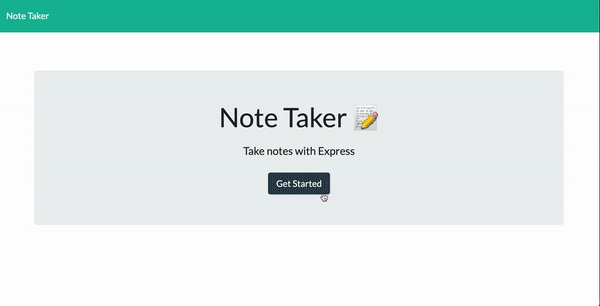

  # Loreina Salalila - Note Taker
  
  ## Description
  Create an application that can be used to write, save, and delete notes. This application will use an express backend and save and retrieve note data from a JSON file. [Check out the deployed project over on Heroku](https://hw-note-taker.herokuapp.com/).
  ## Table of Contents
  * [Usage](#usage)
  * [License](#license)
  * [Contact](#contact)
  * [Screenshots](#screenshots)
  ## Installation
  ```npm init``` is used to install dependencies. is used to install dependencies.
  ## Usage
  Node.js must be installed onto your system prior to usage. Repo MUST include package.json with required dependencies.
  ## License
  
  (https://opensource.org/licenses/MIT)
  ## Contact
  Have a question? Email me directly at vialoraine.gg@gmail.com.
  Check out my other projects at [Vialoraine](https://github.com/Note-Taker).
  ## Screenshots
  